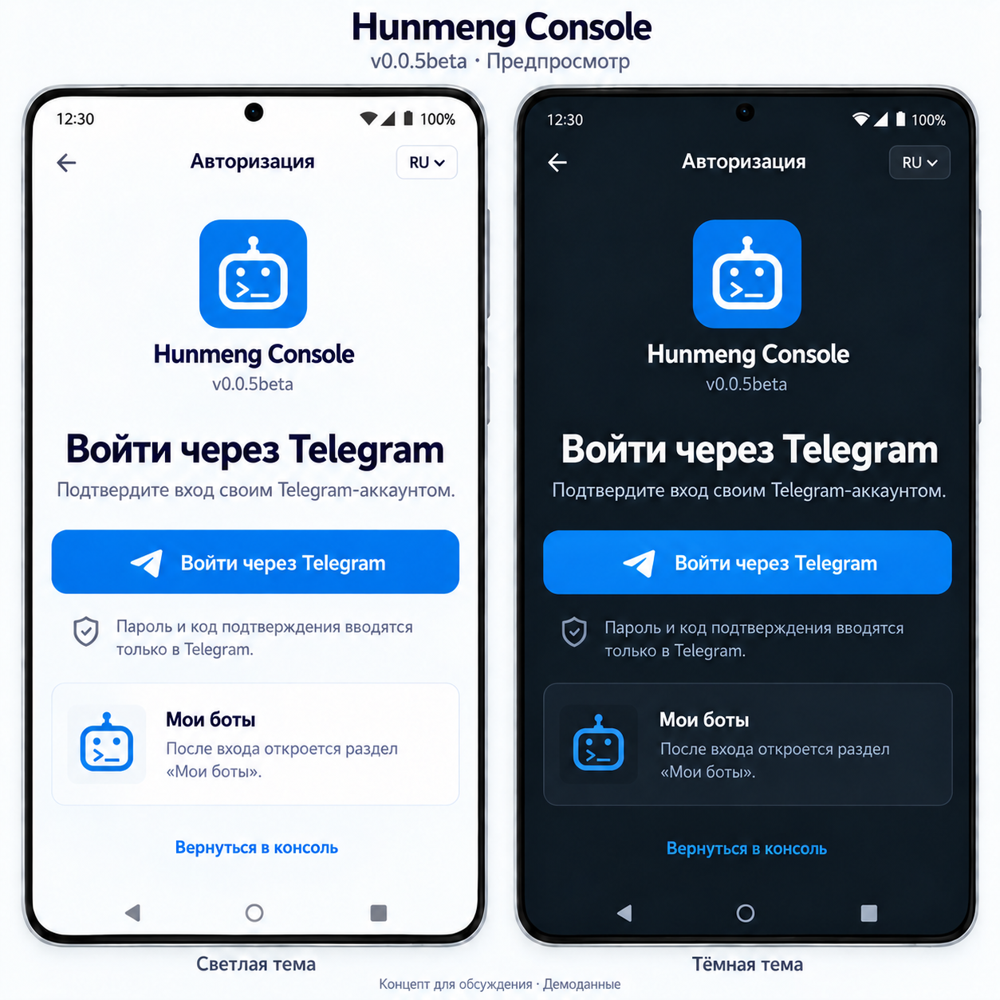
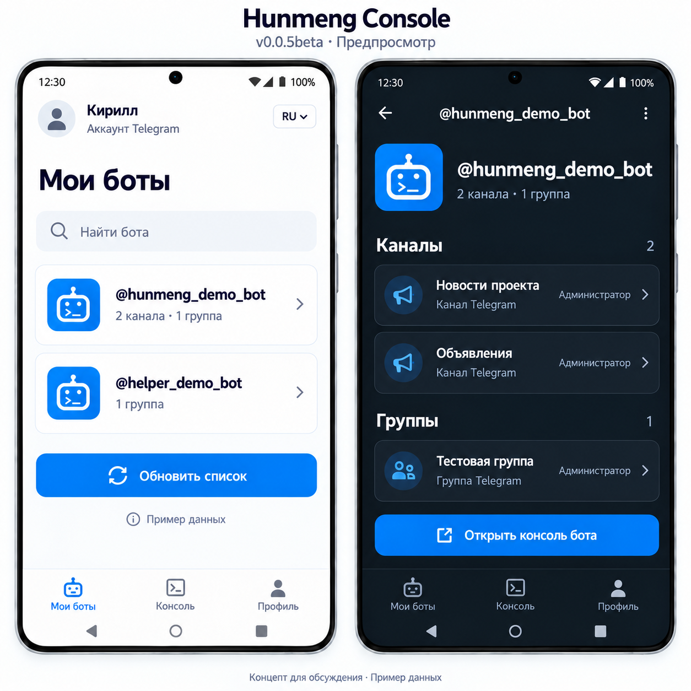
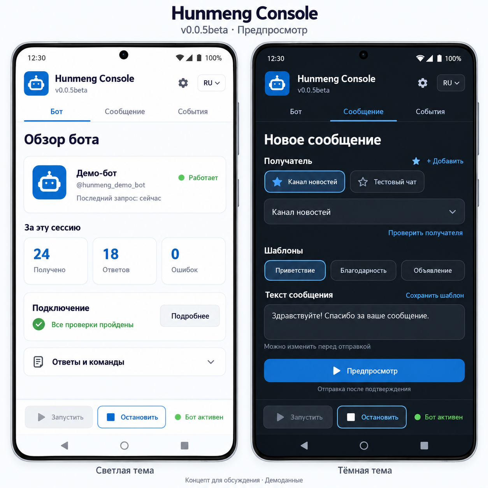
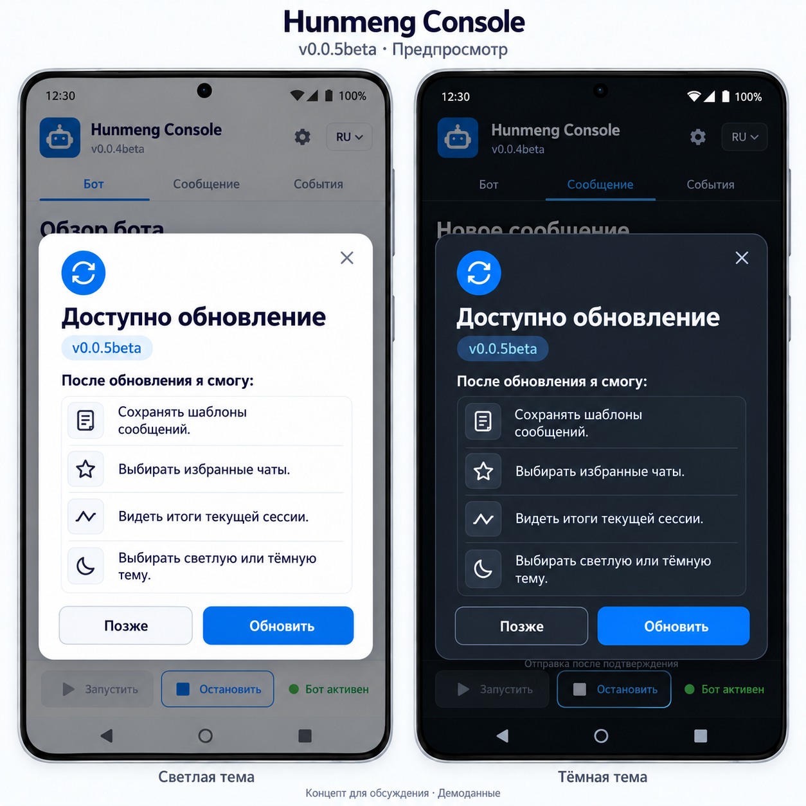
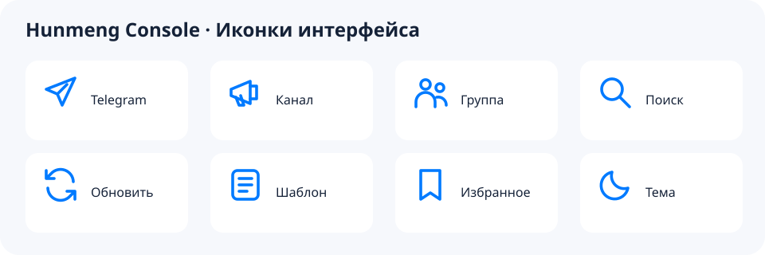

# Hunmeng Console v0.0.5beta — план и визуальный предпросмотр

Обновлено 4 октября 2026 года по Москве. **Это план и статус разработки следующей версии, а не описание выпущленного APK.** Код реализован в ветке `codex/v005-account-session`; настоящий вход, повышение версии и выпуск v0.0.5beta ещё не завершены. Следующий Codex должен сначала прочитать этот план, изображения, отчёт реализации и AGENTS.md.

## Основа и границы следующего обновления

Исходная синхронизация Android с вебом v0.0.4beta выпущена в [v0.0.4-beta-sync](https://github.com/DEXTERITY-maker/hunmeng-console-android/releases/tag/v0.0.4-beta-sync): versionName 0.0.4-beta, versionCode 2; 54 unit-теста пройдены, lint — 0 ошибок / 25 предупреждений. Сейчас веб сообщает v0.0.5beta; это не версия Android APK. Последнее подтверждение установленной версии от владельца — v0.0.3beta. Установка нового APK и проверка телефона остаются отдельными незавершёнными пунктами.

Сертификат последнего публичного APK отличается от предыдущих. Постоянный release-ключ подготовлен в приватном хранилище телефона; CI собирает debug и unsigned release APK, локальная подпись промежуточного кандидата проверена. Для финального выпуска нужны настоящая конфигурация входа и проверка совместимости установки. Новый постоянный ключ не делает сборку совместимой со старой подписью. Не удалять установленное приложение автоматически.

Первоначально этот документ добавлял план и визуальные материалы. Реализация теперь ведётся в `codex/v005-account-session` / draft PR #1; промежуточный статус приведён ниже и в отчёте реализации. Android-релиз v0.0.5beta ещё не выпущен. Проверенная история v0.0.4beta сохранена в архивной части.

## Что попросил владелец и что пока предлагается

| Возможность | Статус обсуждения | Ожидаемое поведение |
| --- | --- | --- |
| Вход через Telegram | Запрошено владельцем | Вход своим Telegram-аккаунтом; после успешной проверки сразу открыть «Мои боты». |
| Боты, созданные аккаунтом | Официальный источник подтверждён: TDLib getOwnedBots; код реализован, живой аккаунт не проверен | Показать именно созданных этим аккаунтом ботов, затем доступные аккаунту каналы и группы с проверкой роли бота. Не подменять список подключёнными токенами. |
| Уведомление о новой версии | Запрошено владельцем | Окно «Доступно обновление» с понятными выгодами и действиями «Позже» / «Обновить». После установки — «Что нового» / «Понятно». |
| Шаблоны сообщений | Предложение для согласования | Явно сохранить текст, вставить в редактируемый черновик, проверить и подтвердить отправку. |
| Избранные получатели | Предложение для согласования | Выбрать сохранённый чат; перед отправкой заново проверить получателя и права. |
| Обзор текущей сессии | Предложение для согласования | Статус, последний успешный запрос, получено / отвечено / ошибки за текущую сессию. |
| Светлая / тёмная / системная тема | Предложение для согласования | Одинаковое поведение в вебе и нативном Android. |

## Изображения — открыть перед реализацией

Все PNG действительно прикреплены в репозитории; относительные ссылки работают после клонирования. Это концепты с примерами данных. Они не подтверждают работоспособность входа или автоматическую загрузку списка.

### 1. Авторизация

Одна основная кнопка «Войти через Telegram», краткое объяснение подтверждения входа и карточка «Мои боты». Точный текст карточки: **«После входа откроется раздел „Мои боты“.»** Успешный вход сразу открывает этот раздел; отмена возвращает на экран входа.

### 2. После входа — «Мои боты», затем каналы и группы

Слева — профиль пользователя, поиск, карточки ботов и обновление списка. Справа — выбранный бот, отдельно «Каналы» и «Группы», роль **бота** в каждом чате, кнопка «Открыть консоль бота». Числа и названия в изображении вымышлены.

Верхний уровень навигации: «Мои боты / Консоль / Профиль». Внутри консоли сохранить существующие вкладки «Бот / Сообщение / События». Не смешивать эти два уровня и не создавать второй polling-контроллер при переходах.

### 3. Предложенные улучшения консоли

### 4. Окно обновления

В этом раннем макете показаны четыре предложения для обсуждения. Итоговый текст должен перечислять только действительно реализованные возможности конкретного выпуска.

### 5. Иконка и элементы интерфейса

**Источник иконки — существующий design/app-icon-source.png.** Не заменять её перерисованным роботом из макетов. Для launcher сохранить текущий tools/PrepareLauncherIcon.java и подготовленные Android-ресурсы.

[Описание макетов, точные подписи и правила оформления](design/v0.0.5beta/README.md).

## Telegram: вход и источник списка — отдельные части

### Вход в аккаунт

Официальные источники, проверенные при подготовке плана:

- [Telegram Login / OIDC](https://core.telegram.org/bots/telegram-login)
- [Официальный Android SDK](https://github.com/TelegramMessenger/telegram-login-android)
- [Managed Bots](https://core.telegram.org/bots/features#managed-bots)
- [Bot API](https://core.telegram.org/bots/api)
- [Авторизация Telegram API](https://core.telegram.org/api/auth)

Для веба рассмотреть официальный Telegram Login / OIDC, для Android — официальный native SDK, совместимый с minSdk проекта. В BotFather понадобятся приложение-бот, разрешённые URL, для Android — package и отпечаток сертификата. Код с PKCE и проверку ID token выполнить на сервере: подпись, issuer, audience, срок действия, nonce/state. Client Secret не включать в APK, JS или репозиторий. Запрашивать минимальные сведения профиля; телефон и разрешение писать пользователю не нужны для этого экрана.

До реализации проверить существующий веб-backend и выбрать место серверной проверки; один декодированный JWT не считать входом. Не копировать логирование ID token из примеров SDK. Учесть отмену, недоступный Telegram, возврат после пересоздания Activity и однократную обработку callback. Требования UI о вводе кода только в Telegram относятся к этому официальному login-flow; при иной архитектуре текст нужно пересмотреть.

### Автоматический список созданных аккаунтом ботов

**Критическое ограничение:** стандартный Telegram Login выдаёт сведения о пользователе, но не перечень его ботов, каналов и групп. Разрешение telegram:bot_access позволяет приложению-боту писать пользователю; оно не открывает управление остальными ботами пользователя.

Managed Bots дают управляющему боту сведения о созданных через него ботах и их создателях. Это полезный отдельный механизм, но документированная схема создания не подтверждает автоматическое обнаружение всех ранее созданных через BotFather ботов. Не выдавать этот неполный список за полный аккаунтный инвентарь.

До реализации автоматической загрузки Codex должен:

1. Подтвердить официальный источник списка **ранее созданных аккаунтом** ботов; записать методы, требования авторизации и ограничения. Обычный Login ID token не использовать как Telegram API-сессию.
2. Отдельно подтвердить источник связи «этот бот состоит в этом канале / группе» и его актуальных прав. Список чатов самого пользователя не является автоматически списком чатов бота.
3. Если требуется дополнительная авторизация Telegram-клиента через TDLib/MTProto, представить отдельную архитектуру владельцу: что она даёт, какие данные доступны, где находится сессия и как её отозвать. Не добавлять полную клиентскую сессию как незаметный побочный эффект кнопки входа.
4. Если полного официального обнаружения подтвердить нельзя, явно сообщить это владельцу и предложить отдельный вариант: подключение существующих ботов, получение событий их участия в чатах, выбор чатов пользователем. Такой вариант требует согласования и не считается исполнением запроса «все созданные аккаунтом боты».

На этапе составления плана способ получения списка был не подтверждён. В ветке реализации найден официальный TDLib `getOwnedBots` / MTProto `bots.getAdminedBots`, добавлены отдельное подключение клиентской сессии и проверки владельца. Владелец согласовал охват «Доступные каналы и группы». Код и mock-сценарии проверены; настоящий аккаунт и его данные ещё не проверены, поэтому готовность пользовательского входа в release notes не заявляется.

### Состояния и достоверность списка

- Сразу после входа открывать «Мои боты», затем показывать загрузку источника.
- Различать: загружается; данные получены; список подтверждённо пуст; источник не подключён; нет доступа; ошибка / повтор; сохранённый список устарел.
- При неподключённом источнике писать «Для загрузки списка нужно подключить источник», а не «У вас нет ботов». Загрузка не должна блокировать выход из аккаунта.
- Не помещать демоботов из PNG в рабочий список. Не выводить нулевые количества неизвестных каналов или групп: показывать «не загружено» либо «доступные каналы и группы».
- У карточки хранить внутренний ID бота, источник, время проверки и отдельно доказательство владельца, если оно доступно. Токен + getMe доказывают возможность доступа, а не факт создания бота этим пользователем.
- Для известных чатов проверять данные и роль бота. Ошибка доступа не означает отсутствие чата. Не обещать полноту списка на основе одних новых updates.
- Данные консоли привязывать к проверенному внутреннему ID аккаунта, а не изменяемому username. Исключить доступ к чужим карточкам через подстановку ID.
- Выход или смена аккаунта отменяет запросы и активную консольную сессию, очищает токены и временные данные. Поздний ответ прежнего аккаунта не меняет новый список.
- Переход к боту не запускает его и не отправляет сообщения. Текущий MVP сохраняет один активный бот и один polling-цикл; переключение бота явно останавливает предыдущую сессию.
- Существующие Bot API-токены остаются только в памяти. Постоянное хранение аккаунтной сессии или токенов не вводить без отдельно выбранной модели.

## Уведомление об обновлении — словами пользователя

Android проверяет реальные **Android-выпуски**, веб — свои выпуски. Версия сайта не запускает обновление APK. Для Android сначала нужны постоянная подпись, честная проверка совместимости и реальный источник метаданных выпуска.

**До установки:**

> Доступно обновление — v0.0.5beta  
> После обновления я смогу:  
> — Входить в Hunmeng Console через Telegram.  
> — Сохранять сообщения как шаблоны и менять текст перед отправкой.  
> — Выбирать избранные чаты без повторного ввода получателя.  
> — Видеть сообщения, ответы и ошибки за текущую сессию.  
> — Выбирать светлую, тёмную тему или оформление как в системе.  
> Позже · Обновить

Это черновик: пункты предложений удалить, если они не входят в фактический выпуск. Пункт «Видеть созданных мной ботов и их каналы и группы» разрешён только после подтверждённой реализации источника данных.

**После установки:** «Что нового в v0.0.5beta», вводная «Теперь я могу…», только фактические изменения, кнопка «Понятно».

Показывать «Что нового» один раз для установленной версии; хранить идентификатор просмотренного выпуска. «Позже» не должно вызывать повтор при каждом открытии экрана; оставить ручной просмотр истории и повтор по разумному расписанию. «Обновить» открывает проверенный HTTPS-адрес соответствующего APK и обычную установку Android. Не отключать системную проверку подписи; при несовместимости объяснить причину без автоматического удаления приложения. При недоступном источнике сохранить работоспособность консоли и показать, что проверка не выполнена.

## Критерии готовности будущей реализации

- [ ] Владелец просмотрел макеты и выбранные предложения; финальный состав выпуска зафиксирован.
- [x] Официальный источник ранее созданных ботов подтверждён; владелец согласовал доступные аккаунту чаты. Настоящие данные ещё требуют проверки.
- [x] Серверная проверка реализована; отмена, неправильная подпись, истёкший token, replay и неправильный callback покрыты тестами с синтетическими данными. Реальный обмен остаётся отдельной проверкой.
- [ ] Реальный вход переводит в «Мои боты»; все состояния загрузки и ошибки различаются; demo-данных в production нет.
- [x] Принадлежность аккаунту отделена от подключения по токену; проверки ID, изоляции и поздних ответов выполнены на mock-данных.
- [x] Отмена запросов при выходе/переключении и один polling-контроллер покрыты тестами; автоматических отправок нет.
- [x] Регрессии RU/EN, памяти токена, диагностики, отчёта, событий, ручной отправки, Unicode, retry_after, offset и запрета повтора sendMessage пройдены.
- [ ] После согласования дополнительных функций проверить шаблон → редактирование → предпросмотр → подтверждение, актуальность избранного получателя и счётчики текущей сессии.
- [ ] Окно обновления использует фактический выпуск своей платформы, корректно обрабатывает «Позже» и однократное «Что нового».
- [ ] Проверить Android CI и регрессии, затем телефон: обе темы, крупный шрифт, клавиатура, поворот, callback, вкладки и установка поверх предыдущего совместимого APK.
- [ ] Повышение versionName / versionCode, публикацию сайта и выпуск APK выполнять только в рамках последующей команды на реализацию/выпуск. Успешную сборку и проверку устройства фиксировать раздельно.

## Промежуточная реализация

Работа ведётся в ветке `codex/v005-account-session`, [draft PR #1](https://github.com/DEXTERITY-maker/hunmeng-console-android/pull/1). Это ещё не выпуск v0.0.5beta.

Владелец выбрал зашифрованное постоянное хранение аккаунтной сессии с удалением при выходе и согласовал «Доступные каналы и группы». Полный официальный источник ботов найден: `getOwnedBots` / `bots.getAdminedBots`. Чаты проверяются по роли самого бота среди доступных аккаунту; недоступные результаты учитываются отдельно.

Добавлены аккаунтная навигация, серверная OIDC-проверка, отдельное согласие TDLib, getOwnedBots, доступные чаты, зашифрованные инструменты и проверяемые Android-обновления. Финальный [Android CI 37171249282](https://github.com/DEXTERITY-maker/hunmeng-console-android/actions/runs/37171249282): 93 теста / 0 failures, lint 0 ошибок / 33 предупреждения, обе native jobs и две успешные проверки эмулятора. APK с TDLib проверен по ZIP/CRC, подписи и метаданным. Сервер: 20/20 тестов; backend опубликован в Site версии 9, но Telegram Client ID/Secret ещё не настроены, `/config` честно возвращает false. Настоящий вход и выпуск APK ещё не завершены. Следующие изменения и проверки описаны в [отчёте реализации](reports/v0.0.5-implementation.md); [нативная сборка](reports/v0.0.5-native-build.md).

Аккаунтная навигация и backend подключены в коде. Для рабочего входа нужны BotFather/API-конфигурация владельца, сборка с публичным Client ID и проверка на устройстве. Постоянная подпись финального APK, метаданные обновления и выпуск ещё предстоят. Уведомление «Мои боты готовы» и новый Android-релиз пока не публикуются. Android-эмулятор и реальный телефон фиксируются отдельно.

Следующий [CI 37172566676](https://github.com/DEXTERITY-maker/hunmeng-console-android/actions/runs/37172566676) прошёл полностью: 93 Android / 20 серверных / 10 packaging-тестов, debug/release lint без ошибок, unsigned release и эмулятор. Локально подготовлен non-debug APK с постоянным сертификатом; [отчёт кандидата](reports/v0.0.5-release-candidate.md) и [повторяемый процесс подписи](tools/RELEASE-PREPARATION.md). Публичный Android-выпуск остаётся v0.0.4beta.

---

## Сохранённый план и результаты v0.0.4beta

Следующий раздел сохранён из main, коммит 38bddec04d6ca919a5aa056b4fde01ff31400e43. Его требования относятся к уже реализованной синхронизации v0.0.4beta; они не являются отметкой о готовности v0.0.5beta.

### Обновление Android v0.0.4beta — синхронизация функций выполнена

План актуализирован 4 октября 2026 года по Москве. Цель — перенести возможности веб-приложения Hunmeng Console v0.0.4beta в существующее нативное Android-приложение. Функциональная синхронизация реализована, проверена в CI и опубликована отдельной сборкой v0.0.4-beta-sync с сохранёнными метаданными 0.0.4-beta / код 2. Первоначальный выпуск с одной новой иконкой сохранён. Установка новой сборки и работа интерфейса на телефоне пока не подтверждены.

#### Текущее состояние

| Часть проекта | Версия и состояние |
| --- | --- |
| [Веб-приложение](https://telegram-bot-console.hunmeng.chatgpt.site) | v0.0.4beta опубликована; диагностика, отчёт, инструменты событий, мобильные вкладки и ссылка @BotFather реализованы в веб-исходниках. |
| Установленное приложение по последнему подтверждению владельца | v0.0.3beta: `versionName = 0.0.3-beta`, `versionCode = 1`. Предыдущая сборка сохранена в [reports/build-v0.0.3-beta.md](reports/build-v0.0.3-beta.md). |
| Первоначальный Android APK v0.0.4beta | [v0.0.4beta в Releases](https://github.com/DEXTERITY-maker/hunmeng-console-android/releases/tag/v0.0.4-beta): `versionName = 0.0.4-beta`, `versionCode = 2`, новая иконка и обозначение версии. Сборка проверена; установка именно этой версии на телефон ещё не подтверждена. |
| Последний опубликованный APK | [Сборка с синхронизацией функций](https://github.com/DEXTERITY-maker/hunmeng-console-android/releases/tag/v0.0.4-beta-sync): 0.0.4-beta, код 2; иконка и пять новых возможностей. |
| Текущие Android-исходники | Диагностика, безопасный отчёт, поиск/фильтры/копирование событий, вкладки, сворачиваемые ответы и @BotFather реализованы. UI и `/version` — `v0.0.4beta`. |
| Синхронизация функций с веб-версией | Пять перечисленных функций перенесены. 54 unit-теста пройдены; устройство требует отдельной проверки владельцем. |

Последняя подтверждённая сборка с функциями: [GitHub Actions](https://github.com/DEXTERITY-maker/hunmeng-console-android/actions/runs/37155736851), коммит `00948ae08954e54d1dc474e0f1512a153cbbcf9e`; 54 unit-теста пройдены, lint — 0 ошибок и 25 предупреждений. Подпись и ZIP/CRC проверены. Размер APK — 12352098 байт; SHA-256: `85df3e542259b20b9ae5c799f2761f446e942853d67bcb9c26bb88af1d535786`. [BUILD-RESULT.md](BUILD-RESULT.md) содержит результаты, [reports/feature-sync.md](reports/feature-sync.md) — описание реализации. Результаты прежнего APK сохранены в [reports/build-v0.0.4-beta-icon.md](reports/build-v0.0.4-beta-icon.md).

[Скачать новый APK](https://github.com/DEXTERITY-maker/hunmeng-console-android/releases/download/v0.0.4-beta-sync/Hunmeng-Console-0.0.4-beta-sync.apk). Его сертификат отличается от обоих прежних APK, поэтому обычное обновление поверх них невозможно. Доступный локальный debug-ключ тоже не соответствует прежним сертификатам. Постоянный ключ CI не настроен; старые APK не заменялись и приложение не удалялось.

Веб-эталон для этого плана: опубликованные исходники коммита `c5c6b4be275834d0c92c2765750e311fa5cfbd3d`. Основные файлы веб-проекта: `lib/releases.ts`, `lib/i18n.ts`, `lib/connection-diagnostics.ts`, `lib/use-bot.ts`, `components/connection-checks.tsx`, `components/event-console.tsx`, `components/bot-console.tsx`.

#### Изменения уже опубликованного Android-выпуска

- Версия UI и ответа `/version`: `v0.0.4beta`.
- Android `versionName`: `0.0.4-beta`; `versionCode`: `2`. Сохранить текущие значения согласно `AGENTS.md`; правка плана сама по себе не повышает версию. При последующем выпуске фиксировать реальные метаданные новой сборки, не сбрасывать код версии.
- Иконка владельца: белый робот-терминал на синем фоне. Использовать существующий исходник, не заменять его новым дизайном или прежним favicon.
- Оригинал 1254×1254: `design/app-icon-source.png`; SHA-256: `b389ba9948e653956a35e0d48c9db3b298658f68c9e9c692b86fa92c0f5c661e`.
- Обычные значки: 48, 72, 96, 144 и 192 px. Адаптивные слои: 108, 162, 216, 324 и 432 px.
- Изображение масштабируется целиком; адаптивный слой имеет пропорциональные поля. В прежней подготовке зафиксированы радиус белой графики 32.42dp и визуальная проверка круглого предпросмотра.
- Генератор ресурсов: `tools/PrepareLauncherIcon.java`.
- Полный проект перенесён в `/storage/emulated/0/Hunmeng Console`; сведения о переносе и проверке файлов — в [TRANSFER.md](TRANSFER.md).

#### Перенесённые функции веб-приложения v0.0.4beta

| Изменение веб-версии | Задача для Android | Статус Android |
| --- | --- | --- |
| Пошаговая проверка подключения | Четыре отдельных состояния: готовность консоли, Telegram, токен, webhook; повтор проверки. | Реализовано; проверены этапы, повтор, отмена и ошибки. |
| Копирование безопасного отчёта | JSON по разрешённому списку полей, Android clipboard и ручное копирование при сбое. | Реализовано и проверено на уровне логики; действие на устройстве ещё не подтверждено. |
| Поиск и инструменты событий | Поиск, фильтры «Все / Ошибки / Команды», копирование отдельной записи. | Реализовано; лимит 150 сохранён, поиск/фильтры/копирование проверены. |
| Мобильные вкладки | «Бот / Сообщение / События», сворачиваемый блок ответов, сохранение состояния при переключении. | Реализовано; состояние и одна сессия сохраняются в общем контроллере. |
| Ссылка возле токена | Оставить видимый текст `@BotFather`, сделать переход к официальному боту. | Реализовано и проверено на уровне логики; действие на устройстве ещё не подтверждено. |

Ниже сохранены требования реализации. Код и автоматические проверки выполнены; границы проверки телефона отмечены в критериях готовности.

##### 1. Проверка подключения

Добавить блок «Проверка подключения» с четырьмя строками и понятными состояниями `idle`, `checking`, `success`, `error`; для активного webhook — `warning`. Показывать состояние значком и текстом, а не только цветом. Все подписи и ошибки доступны на RU/EN.

1. **Консоль:** локальная готовность приложения и API-клиента. Успех этой строки означает готовность к запросу; не выдавать его за проверку интернета.
2. **Telegram:** получен и распознан ответ Telegram на `getMe`.
3. **Токен:** авторизация подтверждена успешным `getMe`. Явный ответ Telegram `401` означает отклонённый токен; локальная проверка формата не является подтверждением авторизации.
4. **Webhook:** после успешного `getMe` выполнить `getWebhookInfo`. Пустой URL — успех; активный webhook — предупреждение и существующее предложение удаления с отдельным подтверждением.

Нативное приложение обращается напрямую к `https://api.telegram.org`. Веб-проверку `/api/version` адаптировать к локальной готовности консоли; не добавлять зависимость Android-подключения от доступности веб-сайта.

- При DNS/TLS/таймауте Telegram недоступен, токен остаётся «не проверен». Сетевая ошибка не означает неверный токен.
- При распознанном ответе Telegram `401` строка Telegram показывает, что ответ получен, а строка токена — ошибку авторизации. Остальные ошибки отображать согласно источнику и этапу; не объявлять токен неверным без соответствующего ответа Telegram.
- Если `getMe` успешен, а проверка webhook завершилась сетевой ошибкой, сохранить подтверждённую авторизацию и отдельно показать сбой webhook. Polling доступен только после подтверждения отсутствия webhook.
- Добавить «Повторить проверку». Для подключённого бота использовать текущую сессию в памяти; не заставлять повторно вводить токен после каждого запроса. Не запускать параллельную диагностику или повтор во время polling, отправки, подключения, отключения либо изменения webhook.
- При отключении или смене токена отменять старую попытку и сбрасывать относящуюся к ней диагностику. Запоздавший ответ старой сессии не должен менять новый результат.
- Ошибки ручной отправки, меню команд и polling показывать рядом с соответствующим действием; не подсвечивать поле токена как неверное из-за несвязанного сбоя.

##### 2. Безопасный отчёт о подключении

Добавить «Скопировать отчёт». Формировать JSON только из явно разрешённых полей, без сериализации всего `ConsoleUiState` или исключения:

- `app`, `platform = android`, `version`, `version_name`, `version_code`;
- `checked_at` — время завершённой проверки в UTC/ISO 8601;
- `checks` — состояния консоли, Telegram, авторизации и webhook;
- `error_code`, `failure_source` — безопасный числовой код и контролируемая категория источника;
- `bot_state`, `last_success_at` — состояние работы и время последнего успешного запроса в UTC/ISO 8601, либо `null`.

В отчёт не включать токен, URL запросов или webhook, имя/username бота, ID чатов и пользователей, текст сообщений, аргументы команд, журнал событий, идентификаторы устройства, исходные ответы API, тексты исключений и stack trace. Времена для отчёта хранить как момент времени, а не восстанавливать дату из отображаемого `HH:mm:ss`.

Использовать Android clipboard. При невозможности копирования открыть диалог с тем же безопасным JSON и выделяемым текстом для ручного копирования. Кнопка недоступна до появления результата проверки и во время диагностики. Подтверждение копирования и диалог перевести на RU/EN.

##### 3. События: поиск, фильтры, копирование

- Добавить поиск без учёта регистра по времени и отображаемому тексту события на выбранном языке. Пустой запрос показывает все записи выбранного фильтра.
- Добавить фильтры «Все / Ошибки / Команды». Фильтрация и поиск меняют отображение, не удаляют исходные записи.
- «Ошибки» должны включать неудачные операции независимо от их тематического типа; хранить признак ошибки отдельно, если это необходимо.
- «Команды» должны показывать принятые команды текущему боту. Сейчас `ConsoleEventType.COMMANDS` используется для синхронизации меню; добавить отдельный структурированный признак/тип полученной команды. Записывать имя команды без аргументов. Игнорирование команд другому боту и сообщений ботов сохраняется.
- У каждой записи добавить копирование времени и безопасного отображаемого текста. Применять существующее скрытие токенов и URL Bot API; не включать скрытые поля объекта. Копирование события может содержать его отображаемый текст, поэтому его не использовать как диагностический отчёт.
- Различать «Событий пока нет» и «По этому запросу событий нет». При ошибке clipboard показать понятное сообщение.
- Сохранить лимит 150 событий только в памяти, возможность очистки и переводы уже записанных событий при смене RU/EN. Поиск пересчитывается на выбранном языке.

##### 4. Мобильная навигация и ответы

- Добавить нативные вкладки «Бот / Сообщение / События» вместо постоянной прокрутки через все разделы.
- «Бот»: подключение, диагностика, сведения о боте и настройки ответов. «Сообщение»: получатель, текст, проверка, предпросмотр, подтверждение и восстановление черновика. «События»: журнал и его инструменты.
- Блок «Команды и ответы» сделать сворачиваемым; на телефоне при первом открытии он свёрнут, как в веб-версии.
- Запуск, остановку и статус оставить доступными на каждой вкладке. Учесть экранную клавиатуру, системные отступы и удобные размеры элементов управления.
- Переключение вкладок не очищает получателя, текст, черновик, журнал, запрос поиска, фильтр и настройки; не останавливает polling и не создаёт второй цикл. Поворот экрана также не создаёт новую сетевую сессию.
- Сохранить существующую политику foreground MVP: уход приложения в фон приостанавливает polling, после возвращения запуск выполняется вручную. Переключение внутренней вкладки не считается уходом в фон.

##### 5. Ссылка @BotFather

Возле поля токена оставить текст **`@BotFather`** и сделать его нажимаемым. Адрес: **`https://t.me/BotFather`**. Он ведёт к официальному боту, у которого пользователь получает токен.

Открывать через Android intent: Telegram, если подходящий обработчик доступен, либо браузер. Отсутствие обработчика не должно приводить к падению; показать сообщение на выбранном языке. Не добавлять токен или другие данные в ссылку.

#### Что сохранить при обновлении

- Существующий проект Kotlin/Jetpack Compose, `applicationId` и namespace `chat.hunmeng.console`, настройки пользователя и подготовленную иконку. Не переделывать приложение в WebView.
- Токен только в памяти процесса. Не использовать для него SharedPreferences, DataStore, SavedStateHandle, rememberSaveable, файлы, логи, резервные копии или секреты CI. После уничтожения процесса нужен новый ввод; при отключении ссылка на токен очищается.
- Получатель, текст, черновик, события и диагностические результаты также остаются в памяти. Язык, пользовательское приветствие и эхо сохраняются прежним способом; переключение языка не перезаписывает пользовательский текст.
- Прямой HTTPS Bot API, обычную проверку TLS, отмену HTTP-запросов, единственный polling-цикл, offset, защиту от дубликатов, восстановление связи и полный `retry_after`.
- `/start`, `/help`, `/ping`, `/id`, `/version`, адресацию команд, эхо только обычного текста в личных чатах, синхронизацию меню RU/EN и ручной повтор при её ошибке.
- Ручную отправку только после `getChat`, полного предпросмотра и подтверждения; отправку именно проверенному ID. Лимит — 1–4096 Unicode-кодовых точек.
- Не повторять `sendMessage` автоматически. При неизвестной доставке сохранить черновик и предложить проверить чат перед ручным повтором.
- Удаление webhook только с подтверждением и `drop_pending_updates=false`.

#### Версия, история и обновление установленного APK

После реализации в разделе «Что нового» перечислить пять перенесённых возможностей веб-версии и новую Android-иконку. В истории Android показывать реальные Android-выпуски: v0.0.3beta и опубликованную v0.0.4beta с иконкой; функциональную синхронизацию отмечать только после её фактического выпуска. Более ранние версии веб-сайта не выдавать за существовавшие APK.

Версия веб-сайта не является источником обновлений Android. До настройки реального источника Android-релизов сохранять честное сообщение, что проверка обновлений APK не настроена.

Опубликованная v0.0.4beta уже имеет другую подпись, чем установленная v0.0.3beta: несовместимость зафиксирована в `BUILD-RESULT.md`. Для будущей установки поверх существующего приложения нужен соответствующий прежний ключ, если он доступен; не заменять его новым ключом молча. GitHub runner создаёт debug-ключ, и его совпадение с ключом установленного APK не гарантировано. Один постоянный новый ключ не делает APK совместимым с уже установленной старой подписью. Не удалять установленное приложение автоматически; доступность ключа и фактическую совместимость новой сборки указать в результате сборки.

#### Проверка и критерии готовности

##### Функции и регрессии

- [x] Четыре строки диагностики и RU/EN работают; проверены успешное подключение, Telegram `401`, DNS/таймаут, активный webhook и сбой webhook после успешного `getMe`.
- [x] Повтор, отключение и смена токена не создают параллельные попытки; старый ответ не меняет состояние новой сессии.
- [x] Отчёт проходит проверку разрешённого списка: тестовые токен, username, ID, сообщения, аргументы, URL и текст исключений в него не попадают. Проверены внедряемая операция clipboard и идентичный JSON для ручного копирования; системное действие требует проверки телефона.
- [x] Поиск и все три фильтра работают совместно, записи не теряются; команды другому боту игнорируются; смена языка обновляет прошлые события и результаты поиска.
- [x] Контроллер сохраняет вкладки, сворачивание, поля и поиск; переключение вкладок, пауза и возврат не создают второй polling-цикл. ViewModel сохраняет контроллер при пересоздании Activity.
- [ ] Физический поворот и взаимодействие с Compose UI на телефоне: подтвердить после установки.
- [x] URL `@BotFather` и обработка отсутствия обработчика проверены через внедряемую операцию открытия; ACTION_VIEW реализован.
- [ ] Реальное открытие @BotFather и системное копирование/ручной выбор текста на телефоне: подтвердить после установки.
- [x] Сохранены существующие регрессии: отмена HTTP/polling, offset и дубликаты, backoff и `retry_after`, Unicode-лимит, запрет автоматического повтора отправки, черновик при неизвестной доставке и скрытие токена.

Сетевые сценарии разработки проверять через локальный MockWebServer и тестовые данные. Не читать локальные файлы с Telegram-токенами, не отправлять настоящие сообщения и не менять настройки живого бота для разработки.

##### Сборка и подтверждение выпуска

- [x] После реализации выполнить в существующем GitHub Actions на Ubuntu x64/JDK 17: `./gradlew testDebugUnitTest lintDebug assembleDebug --no-daemon --console=plain`.
- [x] Проверить APK с реализованными функциями: package `chat.hunmeng.console`, текущие согласованные метаданные версии (`0.0.4-beta`, код `2`, пока владелец не запросил их повышение), подпись, SHA-256 и сохранённую иконку. Отличать его коммит и контрольную сумму от уже опубликованного APK с иконкой.
- [x] Зафиксировать коммит, ссылку на CI, реальные результаты тестов/lint, путь APK и результат проверки совместимости подписи в `BUILD-RESULT.md`. Обновить README и этот план по фактически выполненной работе.
- [ ] После установки владельцем отдельно подтвердить версию, новую иконку, работу интерфейса и подключение бота на устройстве. Успешная сборка не заменяет проверку телефона.

Из Termux на общей памяти вызывать скрипты через `sh`; Git — с `-c safe.directory="/storage/emulated/0/Hunmeng Console"`, не меняя глобальную конфигурацию доверия. Основной путь сборки остаётся GitHub Actions; ограничения локального ARM64-toolchain описаны в README.

Статус: код пяти функций реализован, 54 теста и lint пройдены, новый APK проверен и опубликован отдельно. Установка на телефон пока подтверждена только для v0.0.3beta; UI, физический поворот, системный clipboard, открытие ссылки и настоящий бот в новой сборке ожидают подтверждения владельцем. Результаты unit-тестов не выдаются за проверку Android-устройства.
