# Снимки нового Android-интерфейса

[CI 37998764751](https://github.com/DEXTERITY-maker/hunmeng-console-android/actions/runs/37998764751), source `ee8d7c12e4b1c9073b967d972eba56a773b128c6`; Android 15 x86_64 / Pixel 2. Все PNG скопированы из CI без редактирования; точные пути и SHA-256 сохранены в [provenance.json](provenance.json).

Это работающий Compose UI на чистом эмуляторе. Карточки аккаунта и бота используют синтетические fixtures, окно обновления — синтетический AndroidReleaseSource. Они показывают оформление и проверяют действия, но не подтверждают настоящий Login, список аккаунта или опубликованную v0.0.5beta. Реальный кандидат сохраняет 0.0.4-beta / код 2.

## Обычный шрифт

### Вход, исходная иконка и точная подпись «Мои боты»

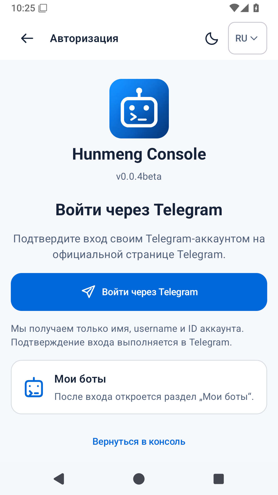

### Обзор консоли в светлой теме

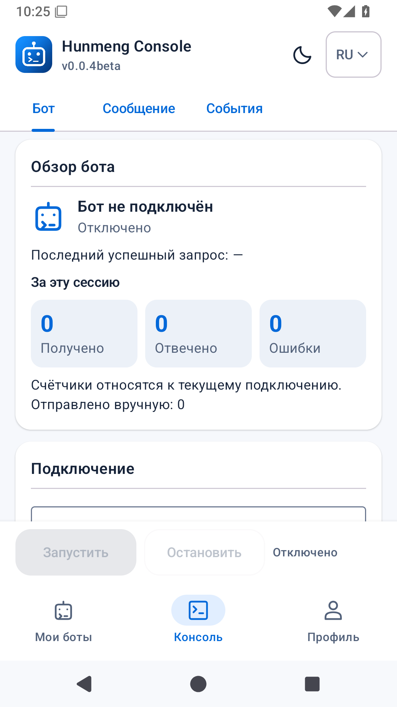

### Обзор консоли в тёмной теме

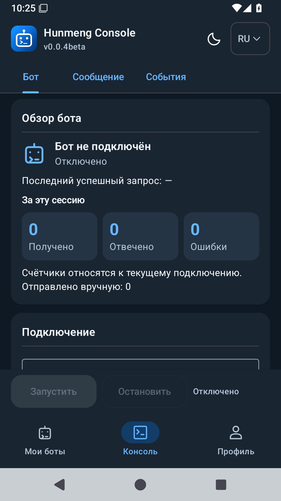

### Форма сообщения и предпросмотр

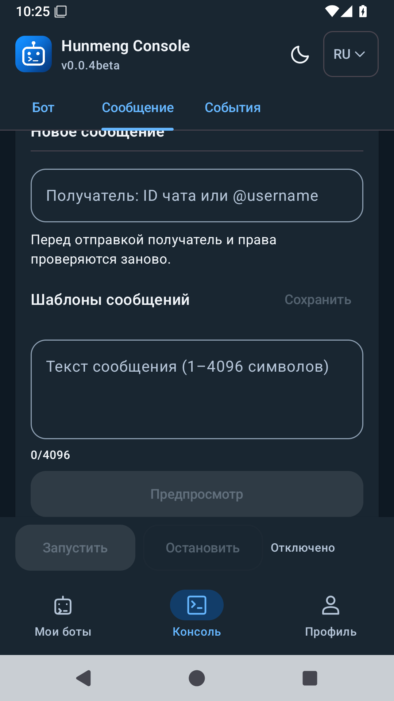

### Компоненты профиля, бота и чата с синтетическими данными

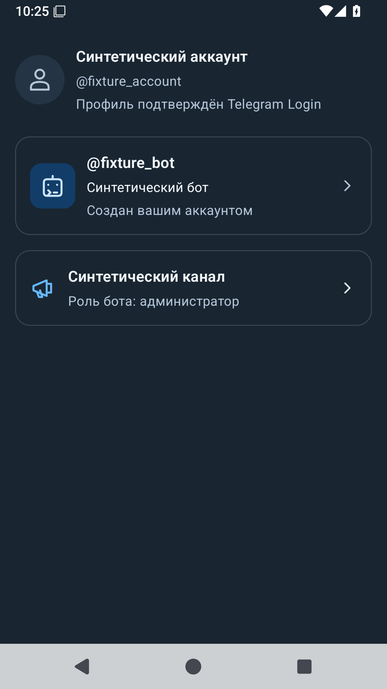

### Синтетическое окно Android-обновления в светлой теме

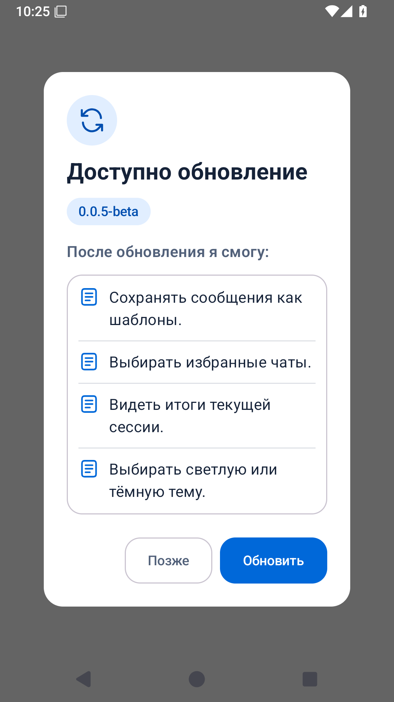

### Синтетическое окно Android-обновления в тёмной теме

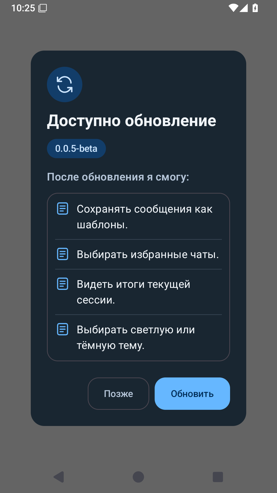

### Настоящая экранная клавиатура и доступные кнопки

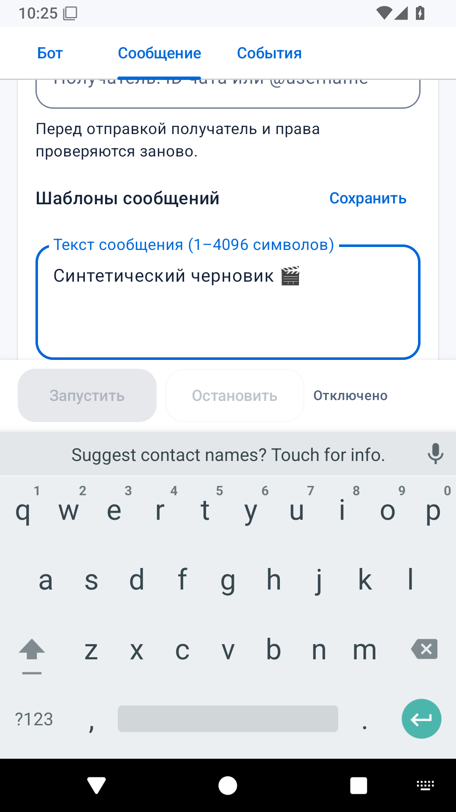

## Системный шрифт 1.6

При крупном шрифте тело экрана прокручивается, заголовки переносятся. Список изменений в диалоге также прокручивается; кнопки остаются доступны.

### Полная нижняя карточка входа и возврат над системной панелью

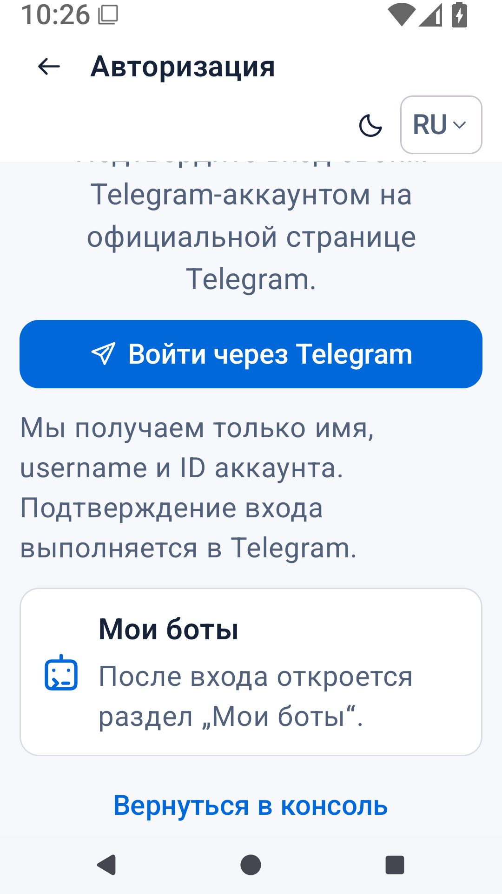

### Настоящая экранная клавиатура и доступные кнопки

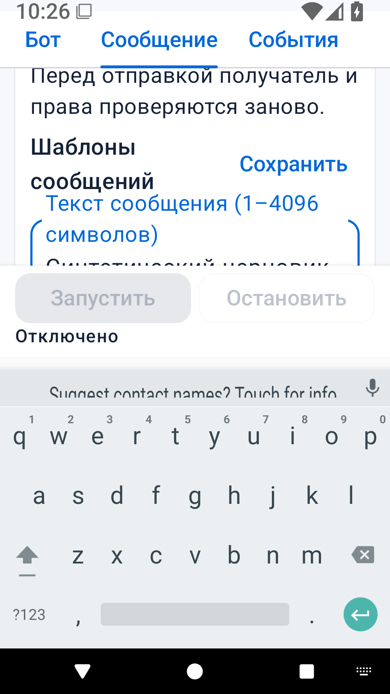

### Landscape: язык, тема и разделы перед боковой системной панелью

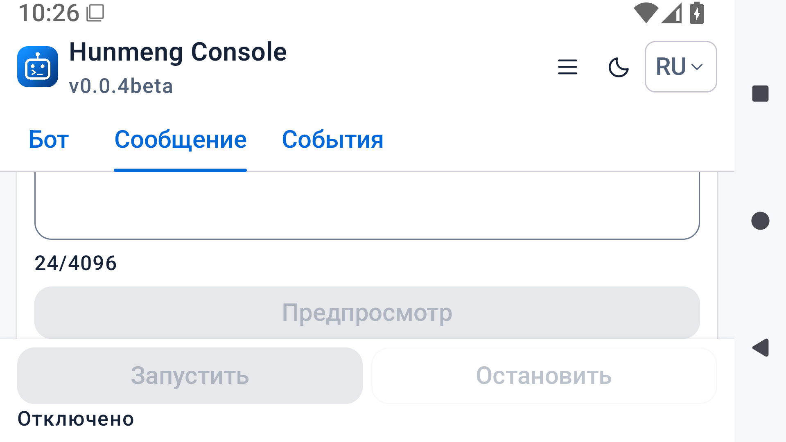

### Синтетическое окно Android-обновления в тёмной теме

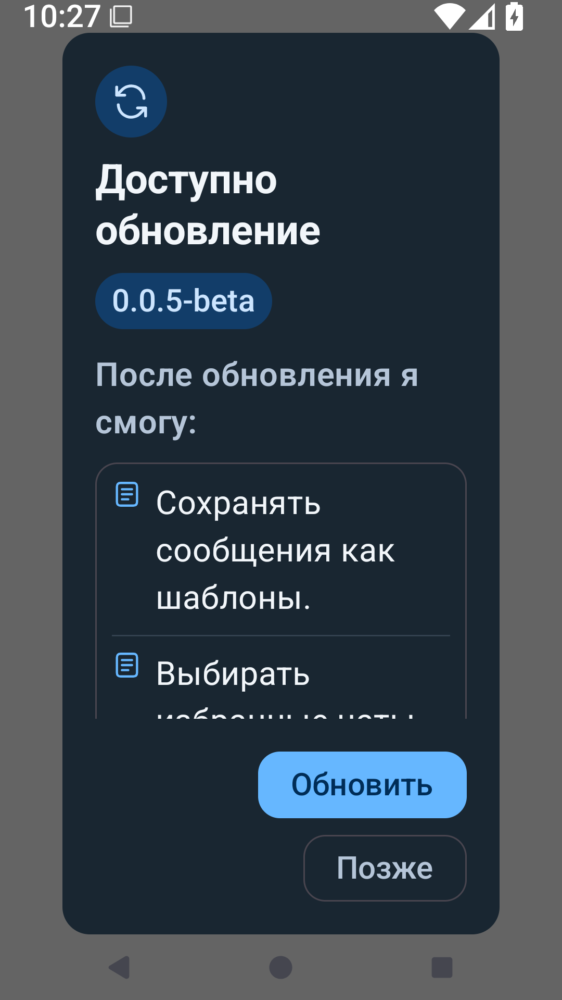

